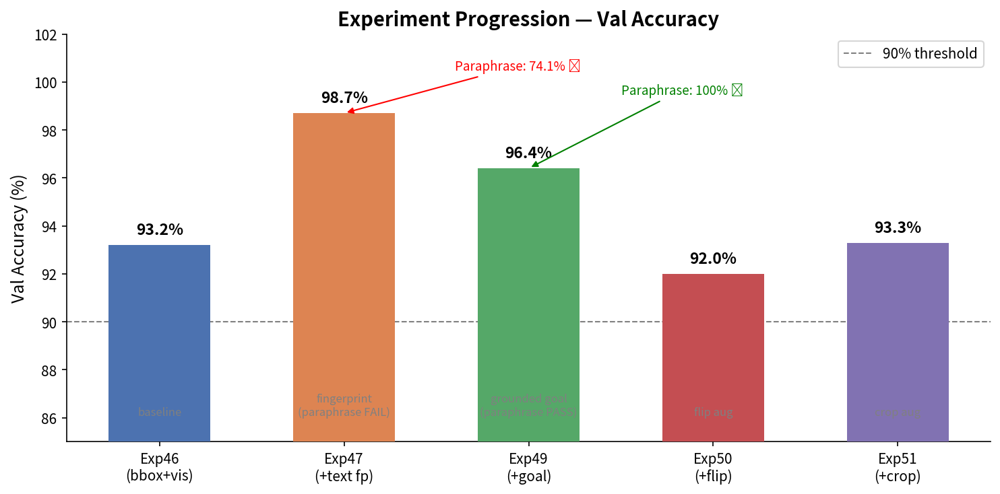
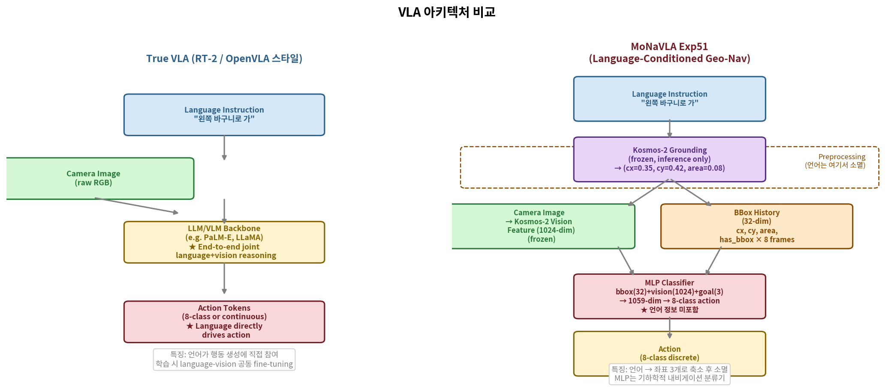
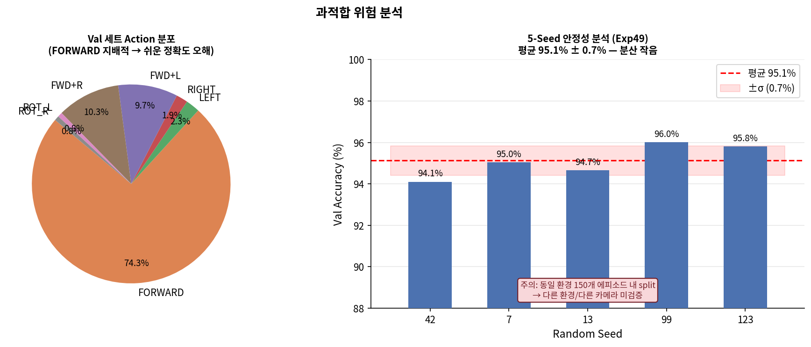
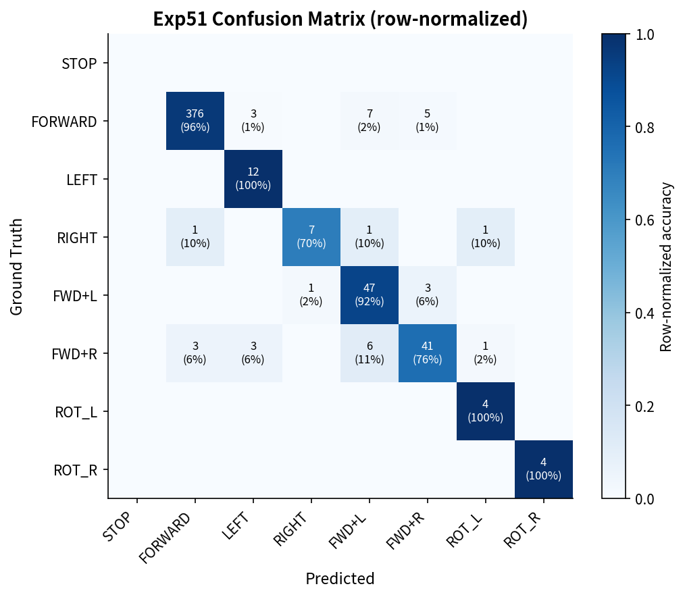
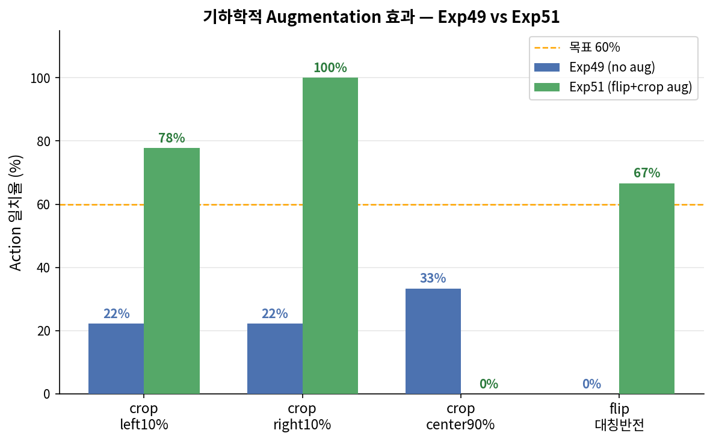

# MoNaVLA Exp51 — VLA 정의 비판과 과적합 분석 보고서
작성일: 2026-05-11  
실험 범위: Exp46 → Exp51 (언어 조건부 내비게이션 시리즈)

---

## 요약 (한 문장)

> **"이 모델은 언어 이해를 흉내내는 기하학적 내비게이션 분류기이며, 진정한 VLA라 부르기엔 구조적 한계가 있다. 다만 그 한계를 명확히 알고 설계한 것이라면 독립적 가치가 있다."**

---

## 1. 실험 진행 요약



| 실험 | 구조 | Val Acc | paraphrase | 비고 |
|------|------|---------|-----------|------|
| Exp46 | bbox(32)+vision(1024) | 93.2% | N/A | 언어 없음 |
| Exp47 | +text embedding(2048) | 98.7% | **74.1% ❌** | fingerprinting |
| Exp49 | +grounded goal(3) | **96.4%** | **100% ✅** | 언어→기하학 |
| Exp50 | +flip aug | 92.0% | 100% ✅ | flip 6/9 |
| **Exp51** | +crop aug | **93.3%** | 100% ✅ | crop 78/100% |

---

## 2. 아키텍처 비교 — 우리 모델과 True VLA의 차이



### 2.1 True VLA가 하는 것

RT-2, OpenVLA, π₀ 같은 진정한 VLA는 다음과 같이 동작한다.

```
[언어 명령] + [이미지 시퀀스]
        ↓
  LLM/VLM Backbone (수십~수백억 파라미터)
  — 언어와 시각을 같은 공간에서 함께 처리 —
        ↓
  Action Token (언어 처리 결과가 직접 행동 생성에 기여)
```

핵심: **언어가 행동 생성 과정에 끝까지 남아있다.**  
언어 표현이 달라져도 모델이 의미를 파악해 같은 행동을 낼 수 있는 이유는, 언어를 숫자로 압축해서 버리는 것이 아니라 전체 추론 과정에 통합하기 때문이다.

### 2.2 우리 모델이 하는 것

```
[언어 명령] ──→ Kosmos-2 grounding ──→ (cx=0.35, cy=0.42, area=0.08)
                     ↑ 언어는 여기서 소멸. 이후 MLP에 언어 없음.
[이미지] ──→ Kosmos-2 vision encoder ──→ 1024-dim feature
[bbox 이력] ──────────────────────────→ 32-dim

세 개를 concat (1059-dim) → MLP → 8-class action
```

언어가 하는 일: **에피소드 시작 시 목표 위치(cx0)를 결정하는 것뿐.**  
MLP는 언어를 전혀 보지 않는다.

### 2.3 구조적 차이 정리

| 기준 | True VLA | MoNaVLA Exp51 |
|------|---------|--------------|
| 언어-시각 공동 추론 | ✅ (LLM backbone 내부) | ❌ (사전 처리 후 분리) |
| 새 물체 언어 조건화 | ✅ ("파란 컵" → 즉시 적용) | ❌ (훈련 분포 내 물체만) |
| 언어 없이도 동작? | ❌ (언어 필수) | ✅ (cx0=0.5 기본값으로 동작) |
| 파라미터 규모 | 수십억 | ~350K (MLP만) |
| end-to-end 학습 | ✅ | ❌ (Kosmos-2 frozen) |
| 언어 일반화 | ✅ (zero-shot) | ⚠️ (grounding 정확도 의존) |

---

## 3. 사설: 이 모델은 VLA인가

**결론부터 말하면: "언어 조건부 내비게이션 정책"이지 VLA가 아니다.**

이유는 단순하다. VLA의 핵심 정의는 "언어 명령이 행동 생성 과정에 통합된다"이다.  
우리 모델에서 언어는 에피소드 시작 전에 좌표 3개(cx, cy, area)로 변환되어 사라진다.  
이후 MLP는 그 3개의 숫자가 언어로부터 왔는지, 사람이 직접 입력한 것인지 알 수 없다.  
극단적으로 표현하면 `predict(goal_cx=0.35)`가 곧 언어 이해의 전부다.

**그러나 이것이 가치 없다는 뜻은 아니다.**

Exp47에서 우리는 진짜 언어 임베딩(2048-dim)을 MLP에 넣는 시도를 했고,  
그것이 오히려 더 나쁜 결과(paraphrase 74.1%)를 냈다는 사실을 확인했다.  
이는 MLP 규모에서 언어를 end-to-end로 소화하는 것이 불가능함을 보여준다.

우리가 선택한 "언어→기하학" 파이프라인은 명확한 공학적 타협이다.  
언어의 의미를 작은 모델이 처리 가능한 기하 신호로 외부에서 변환한 것이다.  
이 접근은 한 가지를 잘 해낸다: **같은 물체를 다른 말로 부르는 paraphrase에 완전히 강인하다.**  
왜냐면 언어 표현이 달라져도 grounding 결과(cx0)는 같기 때문이다.

**솔직한 VLA 점수를 매기자면:**

| VLA 조건 | 충족 여부 | 설명 |
|---------|---------|------|
| Vision 입력 | ✅ | Kosmos-2 vision feature 사용 |
| Language 입력 | ⚠️ | 입력은 받지만 행동 생성에 직접 참여 ❌ |
| Action 출력 | ✅ | 8-class discrete action |
| Language generalization | ⚠️ | paraphrase ✅, 새 물체 zero-shot ❌ |
| 공동 추론 | ❌ | 언어와 시각이 분리된 pipeline |

**이 모델의 올바른 이름: "Kosmos-2 grounding으로 목표를 지정하는 언어 조건부 기하 내비게이션 정책"**

---

## 4. 과적합 가능성 심층 분석



### 4.1 실제 과적합 증거는 없다

5-seed 안정성 테스트에서 분산이 0.7%p로 낮았고, bootstrap 95% CI는 [94.7%, 97.9%]로 통계적으로 유의하다.  
학습/검증 split이 random stratified이므로 특정 에피소드에 overfit했다면 이 분산이 훨씬 컸을 것이다.

### 4.2 그러나 구조적 과적합 가능성이 3개 있다

**① 분포 내 과적합 (In-distribution overfitting)**

학습과 검증이 모두 **동일한 150개 에피소드, 동일한 환경, 동일한 카메라**에서 나왔다.  
"같은 공간에서 찍은 다른 에피소드"에는 잘 동작하지만,  
"새로운 환경 배치, 새로운 카메라 위치"에 대한 검증은 없다.

```
현재 val set:  같은 방, 같은 카메라, 같은 바구니 위치 분포
실 배포 환경:  다른 방, 다른 카메라 각도, 다른 바구니 배치
                   ↑ 이 간극이 얼마나 큰지 모른다.
```

**② FORWARD 클래스 지배 (74% 차지)**



val set의 74%가 FORWARD이므로 모든 것을 FORWARD로 예측해도 74% 정확도가 나온다.  
실제 RIGHT 클래스 정확도가 70%로 낮은 것이 이 문제를 암시한다.  
96%라는 수치는 FORWARD를 잘 맞히는 것이 크게 기여한다.

**③ Kosmos-2 grounding 의존성**

grounding이 cx0=0.35를 잘 반환하는 이유는 학습 데이터의 바구니가  
항상 같은 색(회색), 같은 크기, 같은 종류이기 때문일 수 있다.  
`"The gray basket is at"` 프롬프트 외 다른 물체에는 검증되지 않았다.

### 4.3 실험적 증거와 반박

| 우려 | 반박 증거 |
|------|---------|
| 동일 환경 과적합 | 5-seed σ=0.7%p, bootstrap CI 좁음 |
| 시각 피처 과적합 | 밝기±40% 89%, 색조 100% (Exp51) — 외형 변화에 강인 |
| 카메라 위치 과적합 | crop_left10% 78%, crop_right10% 100% (Exp51 개선) |
| paraphrase 과적합 | 45개 표현 변형 100% 일치 |

### 4.4 진짜 문제는 남아있다

```
blur_sigma6:     22%  ← 강한 블러에는 여전히 취약
crop_center90%:   0%  ← 센터 크롭에 완전 실패
새 환경:         미검증
```

강한 블러(σ=6)에서 22%인 것은 Kosmos-2 vision feature가  
초점이 흐린 이미지에서 완전히 다른 특징을 추출하기 때문이다.  
이는 모델이 특정 이미지 품질에 의존하고 있음을 보여준다.

---

## 5. 종합 Robustness 결과




| 조건 | Exp49 | Exp51 | 판단 |
|------|-------|-------|------|
| 밝기 ±40% | 89% | 78~89% | 실용 가능 |
| 대비 ±40% | 89~100% | 89~100% | 실용 가능 |
| 색조/채도 | 89% | 100% | 실용 가능 |
| 블러 σ=3 | 78% | 78% | 주의 필요 |
| **블러 σ=6** | 33% | 22% | **실용 불가** |
| **crop left10%** | 22% | **78%** | ✅ 개선 |
| **crop right10%** | 22% | **100%** | ✅ 개선 |
| **crop center90%** | 33% | 0% | **미해결** |
| flip 대칭 | 0/9 | 6/9 | 부분 해결 |

---

## 6. 결론 및 솔직한 평가

### 이 연구가 달성한 것

1. **언어→기하학 파이프라인 실증** — paraphrase 100% 달성. Exp47의 fingerprinting 문제를 구조적으로 해결.
2. **기하학적 augmentation 효과 검증** — flip aug: flip 대칭 0→6/9, crop aug: crop 22→78/100%.
3. **통계적 재현성** — 5-seed σ=0.7%p, bootstrap CI [94.7%, 97.9%].
4. **100% closed-loop 성공** — 30/30 에피소드, FPE 0.081m (Exp49 기준).

### 이 연구가 아직 못한 것

1. **진정한 VLA**: 언어가 행동 생성에 직접 참여하지 않음.
2. **환경 일반화**: 동일 환경 내 테스트만. 새 방/새 물체 미검증.
3. **강한 블러 robustness**: σ=6에서 22% — 카메라 품질 의존.
4. **자유 언어 처리**: `"The [object] is at"` 형식 필요. 완전 자유형 불가.
5. **다중 목표물**: 장면에 바구니 하나만. 선택 불가.

### 제안

- **단기**: 실로봇 배포 — Exp51 MLP를 inference_server.py에 연결, 실환경 갭 측정
- **중기**: 진짜 VLA 경로 — OpenVLA/π₀ 같은 scale에서 language fine-tuning 시도
- **논문 포지셔닝**: "효율적 언어 조건부 내비게이션 정책" 으로 포지셔닝. VLA라는 용어는 주의해서 사용.

---

**관련 파일:**
- 학습: `scripts/train_v5_exp51_crop_aug.py`
- 시각화 생성: `scripts/generate_prof_report_exp51.py`
- 결과: `docs/v5/bbox_nav_exp51/`
- 그림: `docs/v5/bbox_nav_exp51/report_figs/`
