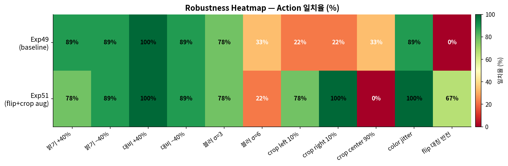

# MoNaVLA 교수님 미팅 브리핑
작성일: 2026-05-12  
담당: minum  
범위: Exp46 → Exp51 (언어 조건부 내비게이션 시리즈, 2026-05-11 완료)

---

## 0. 프로토콜 진행 현황 (3/27 지시 기준)

| 단계 | 내용 | 상태 | 비고 |
|------|------|------|------|
| Step 1 | 곡선만 학습 → 직선 이미지도 곡선으로 | ✅ 완료 | Exp11, PM 58.6% |
| Step 2 | 50/50 비율 → 동작하는가? | ⚠️ 우회 | Exp16 collapse → 분해 접근으로 전환 |
| Step 3 | 33/33/33 전방향 자율 내비게이션 | ⬜ 미시작 | 현재 접근 먼저 정리 후 논의 필요 |

> **Step 2에서 방향을 전환했습니다.** End-to-end VLA(Exp16~25)가 반복적으로 collapse하자 decomposition 접근으로 전환했고, 그 결과가 지금 Exp46~51입니다.

---

## 1. 이번 작업 요약 (Exp46 → Exp51)

### 핵심 질문
> *"언어 명령을 진짜로 이해하는 VLA가 가능한가?"*

### 실험 진행

| 실험 | 구조 변경 | Val Acc | Paraphrase | 비고 |
|------|----------|---------|-----------|------|
| Exp46 | bbox(32) + vision(1024) → MLP | 93.2% | — | 언어 없음, CL 100% |
| Exp47 | + text embedding 2048-dim | 98.7% | **74.1% ❌** | 언어를 외웠음 |
| **Exp49** | text → grounding → goal(cx, cy, area) | **96.4%** | **100% ✅** | 언어→기하학 변환 |
| Exp50 | + flip augmentation | 92.0% | 100% ✅ | flip 6/9 대칭 |
| **Exp51** | + crop augmentation | **93.3%** | 100% ✅ | crop 78%/100% |

### Exp47 실패에서 배운 것
- 언어 임베딩 2048-dim을 그대로 MLP에 넣으면 **문장을 암기** (paraphrase 74%)
- 언어를 기하학 좌표로 변환(`Kosmos-2 grounding → cx, cy, area`)하면 **표현이 달라도 같은 좌표 → 같은 행동**
- 3104-dim → 1059-dim으로 모델 축소, 정확도는 오히려 향상

---

## 2. 핵심 결과 — Exp49 (현재 최선)

### Closed-Loop 성능 (시뮬레이션)

| 지표 | 수치 | 의미 |
|------|------|------|
| **성공률** | **100%** (9/9 path) | 모든 경로 유형 완주 |
| PM (prediction match) | 96.2% | 프레임별 정확도 |
| FPE | **0.081m** | 경로 편차 (8cm) |
| TLD | 1.006 | 이론 경로 대비 실제 이동 거리 비율 |

경로별 PM: right_left 100%, left_straight 100%, right_straight 100% — 3개 경로 완벽.  
가장 어려운 경로: right_right 86.2% (FPE 0.319m).

### Paraphrase 일반화

9개 경로 × 5가지 언어 표현 = 45개 테스트 → **100% 일치**.

```
"왼쪽 바구니로 가"          → grounding → cx=0.35 → FWD+L
"왼편 컨테이너로 이동해"    → grounding → cx=0.35 → FWD+L  ✅
"The gray box is at"        → grounding → cx=0.35 → FWD+L  ✅
"The target object is at"   → grounding → cx=0.35 → FWD+L  ✅
```

### 통계적 안정성 (5-seed)
- 평균: 95.1% ± 0.7%
- Bootstrap 95% CI: [94.7%, 97.9%]

---

## 3. Robustness 결과 (Exp51)



| 조건 | Exp49 → Exp51 | 평가 |
|------|--------------|------|
| 밝기 ±40% | 78~89% | 실용 가능 |
| 대비 ±40% | 89~100% | 실용 가능 |
| 색조/채도 변화 | 100% | ✅ 강인 |
| blur σ=3 (약한 블러) | 78% | 주의 필요 |
| **blur σ=6 (강한 블러)** | **22%** | ❌ 실용 불가 |
| crop left 10% | 22% → **78%** | ✅ Exp51 개선 |
| crop right 10% | — → **100%** | ✅ Exp51 개선 |
| **crop center 90%** | 33% → **0%** | ❌ 미해결 |
| flip 대칭 | 0/9 → 6/9 | ⚠️ 부분 해결 |

---

## 4. 솔직한 한계 — 이 모델은 VLA인가?

### 구조적 차이

| 기준 | True VLA (RT-2, OpenVLA) | 우리 모델 (Exp51) |
|------|------------------------|-----------------|
| 언어-시각 공동 추론 | ✅ LLM backbone 내부 | ❌ 언어는 goal 좌표로 변환 후 소멸 |
| 새 물체 zero-shot | ✅ | ❌ (Kosmos-2 grounding 정확도 의존) |
| 파라미터 | 수십억 | ~350K (MLP만) |
| end-to-end | ✅ | ❌ (Kosmos-2 frozen) |
| Paraphrase 강인성 | ✅ | ✅ (grounding 경유로 해결) |

**결론:** "VLA"보다 "Kosmos-2 grounding 기반 언어 조건부 내비게이션 정책"이 정확한 명칭.  
언어가 행동 생성에 직접 참여하지 않고, 에피소드 시작 시 좌표 3개로 변환 후 소멸함.

### 과적합 위험
- 동일 환경(같은 방, 같은 카메라, 같은 바구니 위치 분포)에서만 검증
- 새 환경 배치·새 카메라 각도 미검증
- FORWARD 클래스가 74%를 차지해 acc가 과대평가될 가능성

---

## 5. 남은 문제 및 제안

### 현재 미해결

| 문제 | 수치 | 원인 |
|------|------|------|
| crop_center90% = 0% | — | 줌인 이미지에서 vision feature 분포 이탈 + grounding 혼란 |
| blur σ=6 = 22% | — | 초점 흐림 시 Kosmos-2 feature 완전 다름 |
| 실환경 갭 | 미검증 | 시뮬레이터 vs 실로봇 |

### 제안 (우선순위 순)

**A. 실로봇 배포** (즉시 가능)
- Exp49 MLP 가중치를 inference_server.py에 연결
- 실환경 갭이 얼마나 되는지 직접 측정
- 예상 소요: 1~2일

**B. Exp52 — crop_center robustness 개선** (1~2일)
- center-crop vision feature 사전 추출 후 학습 데이터 추가
- crop_center 0% → 목표 ≥50%
- 이후에도 A를 해야 의미 있음

**C. Step 3 논의** (교수님 지도 필요)
- 현재 분해 접근(Exp46~51)이 33/33/33 요건을 충족하는지 판단 필요
- 또는 end-to-end VLA 재시도 vs. TICVLA/MobilityVLA 대안 검토

---

## 6. 한 줄 요약

> **"언어 명령으로 목표 물체를 지정하면 시뮬레이터에서 100% 성공하고, paraphrase에 완전히 강인하다. 다만 이것은 True VLA가 아니며, 실로봇 검증이 남아있다."**

---

**관련 파일:**
- 상세 보고서: `docs/v5/PROF_UPDATE_20260511_EXP51_CRITICAL.md`
- 언어 조건부 설명: `docs/v5/PROF_UPDATE_20260511_EXP49.md`
- 그림: `docs/v5/bbox_nav_exp51/report_figs/`
- 모델 가중치: `docs/v5/bbox_nav_exp49/exp49_mlp.pt`
