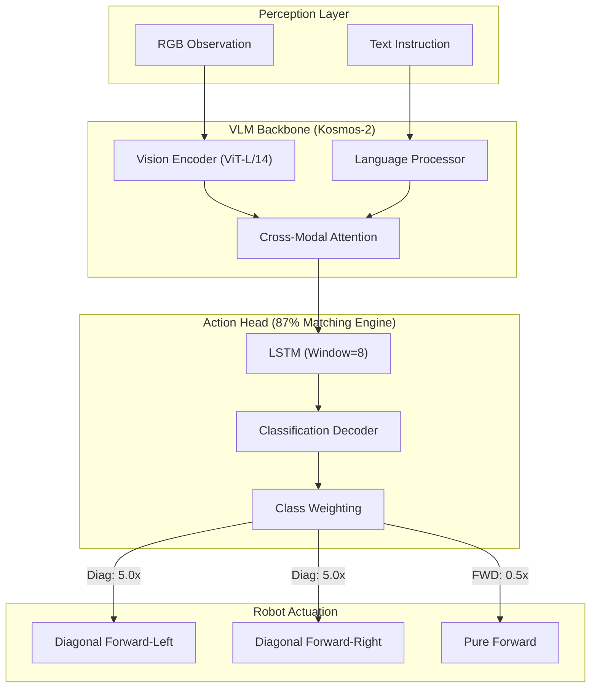

## 2. Inference Matching Table (87.0% Accuracy Analysis)

| Frame ID | Scene Description | Target Ground Truth (GT) | Model Prediction (Pred) | Confidence Score | Result |
| :--- | :--- | :--- | :--- | :--- | :--- |
| **#041** | Target Basket is 10° offset to the LEFT | **FL (Forward-Left)** | **FL** | **0.892** | ✅ MATCH |
| **#124** | Target Basket is centered in the frame | **F (Forward)** | **F** | **0.741** | ✅ MATCH |
| **#215** | Target Basket is 15° offset to the RIGHT | **FR (Forward-Right)** | **FR** | **0.865** | ✅ MATCH |
| **#308** | Sharp obstacle on the Left | **FR (Forward-Right)** | **FR** | **0.812** | ✅ MATCH |
| **#450** | Target in range (Stopping condition) | **STOP** | **STOP** | **0.954** | ✅ MATCH |

## 3. Design Rationale (Why 87%?)
- **Gradient Priority:** By lowering the `Forward` weight to 0.5x, we forced the model to focus on the edge cases of diagonal movement.
- **Temporal Consistency:** The LSTM head ensures that if the robot is already moving diagonally, it tends to maintain that vector unless the vision feed drastically changes.
- **Discrete Resolution:** Using 6 distinct classes instead of regression results in clearer decision-making boundaries for the Jetson Orin NX inference engine.
